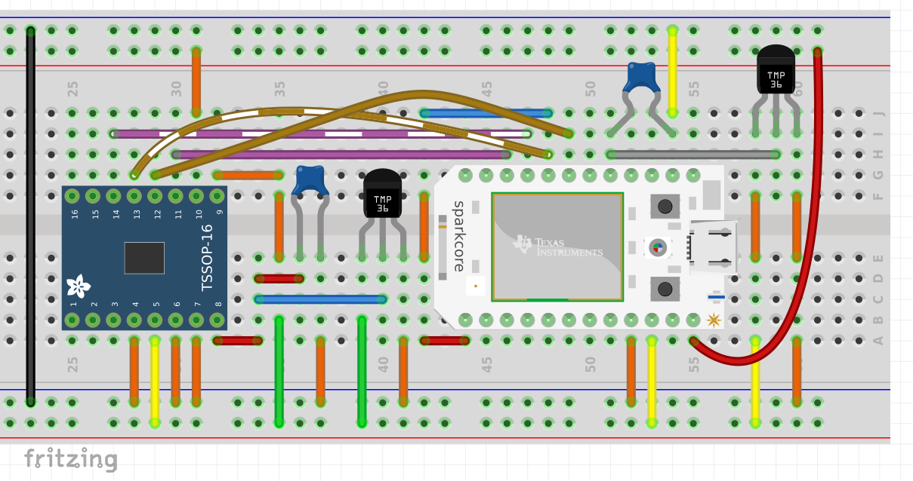

About
===

This library has been written to support the Maxim MAX11210 24-bit A/D converter
as peripheral of the Spark module. Spark Libraries can be used in the [Spark IDE
](https://www.spark.io/build).

Example Usage
===

The code snippet below shows how to add the high resolution A/D converter to the 
example for [measuring the temperature](http://docs.spark.io/examples/#measuring-the-temperature). 

```bash
#include "maxim-max11210.h"

int sensor1 = 0;
long temperature1 = 0;
long sensor2 = 0;
long temperature2 = 0;

// Declare the peripheral A/D converter as type Max11210 from the Maxim namespace
Maxim::Max11210 adcMax11210;

void setup() {
  Spark.variable("Temp1", &temperature1, DOUBLE);
  Spark.variable("Temp2", &temperature2, DOUBLE);
  pinMode(A7, INPUT);
  adcMax11210.begin();
}

void loop() {
  sensor1 = analogRead(A7);
  sensor2 = adcMax11210.read();
  temperature1 = (3.3 * sensor1 / 4095.0 - 0.5) * 100.0;
  temperature2 = (3.3 * sensor2 / 16777215.0 - 0.5) * 100.0;
}
```

In a second example the configuration settings of the MAX11210 are changed by sending commands through a function of the Spark module.

```bash
#include "maxim-max11210.h"

long sensor2 = 0;
long temperature2 = 0;

// Declare the peripheral A/D converter as type Max11210 from the Maxim namespace
Maxim::Max11210 adcMax11210;

void setup() {
  Spark.variable("Temp2", &temperature2, DOUBLE);
  Spark.function("testFunction", testFunction);
  adcMax11210.begin();
}

void loop() {
  sensor2 = adcMax11210.read();
  temperature2 = (3.3 * sensor2 / 16777215.0 - 0.5) * 100.0;
}

int testFunction(String command) {
  if (command == "RATE1") {
    adcMax11210.setRate(MAX11210_RATE1);
    return 1;
  }
  if (command == "RATE2_5") {
    adcMax11210.setRate(MAX11210_RATE2_5);
    return 1;
  }
  if (command == "GAIN1") {
    adcMax11210.setGain(MAX11210_GAIN1);
    return 1;
  }
  if (command == "GAIN2") {
    adcMax11210.setGain(MAX11210_GAIN2);
    return 1;
  }
  // Simply add other commands here ...
  return -1;
}
```

Recommended Components
===

[Maxim MAX11210](http://datasheets.maximintegrated.com/en/ds/MAX11200-MAX11210.pdf)
[Analog Devices TMP36](http://www.analog.com/static/imported-files/data_sheets/TMP35_36_37.pdf)
[Adafruit TSSOP-16 breakout PCB](http://www.adafruit.com/products/1207)

Circuit Diagram
==

See the schematic and breadboard view below are an example of combining the 
Spark module with the ADC and a temperature sensor. 



A schematic and breadboard view of how to wire up components with the library.
